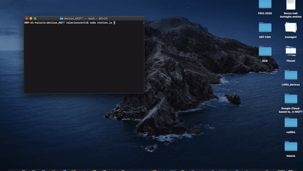

# Google-Cloud-based-IoT-system-with-MQTT

This is a project made for the Internet of Things class at the Sapienza University of Rome. It is maded of two components:
* **Environmental Station**: It is a cloud-based IoT system that collects information from a set of virtual environmental sensors using the MQTT, MQTT-SN, and LoRaWAN protocol and displays it in a simple web site dashboard.
* **User Activity Recognition**: HTML5 crowd sensing application that, using the Generic Sensor API, collects data from the accelerator sensor of the mobile phone and  predict the activity of the user: Still or Moving.

The MQTT is managed using the cloud-based backend of the Google IoT Core platform.

Technology used: Python, C, RIOT-OS, MQTT-SN, LoRaWAN, Node.js, MQTT, WebSockets, MongoDB, JQuery, Bootstrap CSS and HTML, Generic Sensor API.
___
## Assignments
The following are the branches that contain all the assignments one after the other:
* ##### [Assignment 1](https://github.com/valecor95/Google-Cloud-based-IoT-system-with-MQTT/tree/assignment1)
* ##### [Assignment 2](https://github.com/valecor95/Google-Cloud-based-IoT-system-with-MQTT/tree/assignment2)
* ##### [Assignment 3](https://github.com/valecor95/Google-Cloud-based-IoT-system-with-MQTT/tree/assignment3)
* ##### [Assignment 4](https://github.com/valecor95/Google-Cloud-based-IoT-system-with-MQTT/tree/assignment4)

___
